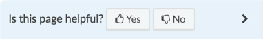
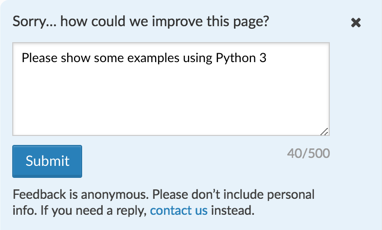

# Rate the Docs

*Rate the Docs* helps documentation authors collect feedback. It's designed 
to work easily with *[Read the Docs][]*-hosted projects, and can be adapted 
for other sites.

It adds a simple question to the bottom of each docs page:



Readers who indicate the page isn't helpful are prompted for additional
feedback:



By default, feedback is recorded using Google Analytics events. This enables
reporting on the least and most helpful pages, and allows segmenting "page 
helpfulness" reports by other data GA already collects.

You can supply your own feedback collection API if you don't want to use 
Google Analytics.


## Basic installation

This is the simplest installation:

* for Sphinx docs projects hosted on *Read the Docs*
* loading the latest *Rate the Docs* code from the [Unpkg CDN][]
* using Google Analytics to record feedback 

(Other configuration options are described [below](#advanced-installation).)

1. If you haven't already, [enable Google Analytics][rtd-ga-config] for your 
   *Read the Docs* project, in the RTD project admin page under "Advanced."
   
2. Make sure the *Rate the Docs* "contact us" link will go somewhere useful. 
   If you already have a docs page at `/contact`, great, you're all set.
   
   If not, set up a [page redirect][rtd-page-redirect] in the RTD project 
   admin under "Redirects." You'll want to redirect from `/contact` to 
   whatever your docs contact page is (like say, `/support/help.html`; you 
   shouldn't need to include any `/en/latest` language or version prefixes).

3. Edit your `docs/conf.py` to tell Sphinx to load the *Rate the Docs* code:

    ```python
    # docs/conf.py
    # ... if you already have a setup() function, just add to it;
    # otherwise define setup() toward the end of conf.py:
    def setup(app):
        app.add_javascript("https://unpkg.com/rate-the-docs")
        # ... (any other setup you already had)
    ``` 

Now publish your docs, and you should see a feedback widget at the bottom
right.


## Google Analytics reporting

*Rate the Docs* feedback will appear in Google Analytics under Behavior > 
Events, with the category RateTheDocs. 

You may want to define some custom Google Analytics reports:

*Pages by average helpfulness*

* Primary dimension: Page
* Filter: Event Action = Helpful Vote
* Sort: Avg. Value descending (or ascending)

*Most-downvoted pages*

* Primary dimension: Page
* Filter: Event Action = Helpful Vote; Event Label = No 
  (or Yes for most-upvoted pages)
* Sort: Unique Events descending

Tip: check unique events (rather than total events) to discount the same
user repeatedly voting on the same page during a single session.

*Suggestions*

* Dimensions: Page, Event Label, Date
* Filter: Event Action = Suggestion
* Sort: Date descending

The event label contains the suggestion text.


## Advanced installation

### Code loading options

If you're not comfortable loading the latest *Rate the Docs* code (which might 
change over time), you can pin a specific version:

```python
# docs/conf.py
def setup(app):
    # pin to version @0.1.0
    app.add_javascript("https://unpkg.com/rate-the-docs@0.1.0")
``` 

or you can copy the rate-the-docs.min.js file into your `docs/_static` directory 
and serve it yourself:

```python
# docs/conf.py
def setup(app):
    app.add_javascript("rate-the-docs.min.js")
``` 

### Custom contact link

Rather than setting up a `/contact` redirect in *Read the Docs,* you can use
a JavaScript global variable to change the "contact us" link.

You'll need to add some custom JavaScript code to your Sphinx project. An
easy way to do this is to create a JS file in your Sphinx `docs/_static` dir:

```javascript
// docs/_static/my-project-config.js
window.RATETHEDOCS_OPTIONS = {
  contactLink: "/support/options"
};
``` 

... and then edit your `docs/conf.py` to tell Sphinx to load the new JS file:

```python
# docs/conf.py
# ...
def setup(app):
    app.add_javascript("my-project-config.js")  # <-- add this
    app.add_javascript("https://unpkg.com/rate-the-docs")
    # ...
``` 

The `contactLink` can be any valid HTML `<a href>`, like 
`"https://docs.example.com/support#contact"` 
or `"mailto:support@example.com"`. 
Relative links are resolved relative to your docs pages.

(You can also set up `RATETHEDOCS_OPTIONS` in a `<script>` tag in a custom
Sphinx template, or in any other custom JS file you're loading.)


### Custom feedback recording

If you don't want to use Google Analytics, you can supply your own feedback
recording functions in the JavaScript global variable `RATETHEDOCS_OPTIONS`:

```javascript
window.RATETHEDOCS_OPTIONS = {
  // ... other options ... ,
  recording: {
    init: function() { /* ...; */ return true; },
    recordUpVote: function() { /* ... */ },
    recordDownVote: function() { /* ... */ },
    recordSuggestion: function(text) { /* ... */ }
  }
};
``` 

The `recording.init()` function must return `true` if *Rate the Docs* should
be enabled; otherwise, the feedback widget will not appear. (The default
implementation disables the widget if the user's browser has do-not-track
set or if Google Analytics can't be loaded.)


### Non-*Read the Docs* use

If you want to use *Rate the Docs* somewhere other than *Read the Docs*,
you'll need to ensure that your docs site has:

* A page layout roughly similar to that provided by [sphinx-rtd-theme][]
  (or you may need to override the positioning from *Rate the Docs'* CSS)
* [Wyrm][] base CSS styles or similar, plus its CSS class `.sr-only` and 
  button styling classes `.btn`, `.btn-info`, `.btn-neutral` and `.btn-link`)
* [Font Awesome 4.7][]

(sphinx-rtd-theme includes all of these, and for simplicity and code size 
*Rate the Docs* just assumes they're there.)
 

## Development

To build *Rate the Docs,* use yarn (or npm):

```shell
yarn install --dev
yarn build
```

*Rate the Docs* targets modern browsers, and specifically doesn't attempt to
be compatible with any version of Internet Explorer (other than quietly
not loading in IE).


[Font Awesome 4.7]: https://fontawesome.com/v4.7.0/
[Read the Docs]: https://readthedocs.org/
[rtd-ga-config]: https://docs.readthedocs.io/en/latest/guides/google-analytics.html
[rtd-page-redirect]: https://docs.readthedocs.io/en/latest/user-defined-redirects.html#page-redirects
[sphinx-rtd-theme]: https://sphinx-rtd-theme.readthedocs.io/en/latest/
[Unpkg CDN]: https://unpkg.com/
[Wyrm]: https://wyrmsass.org
